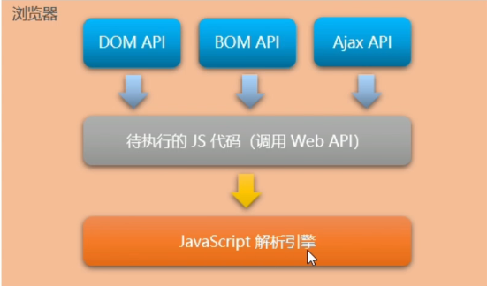
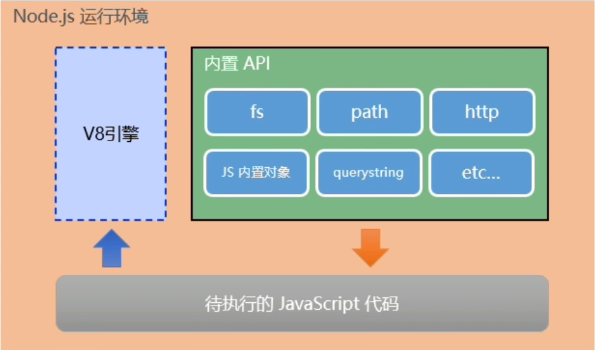
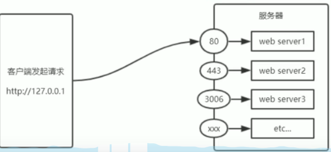
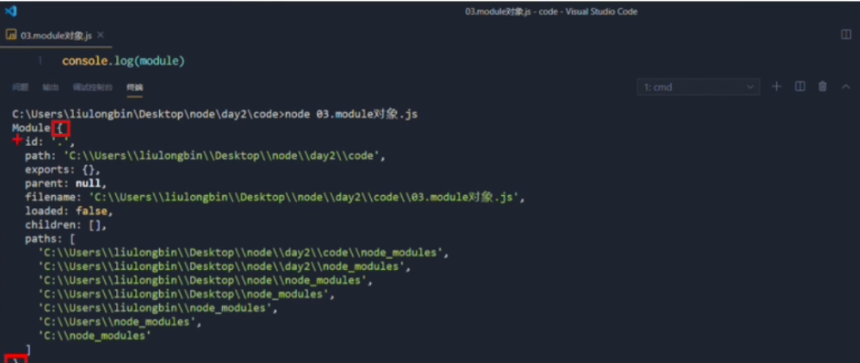
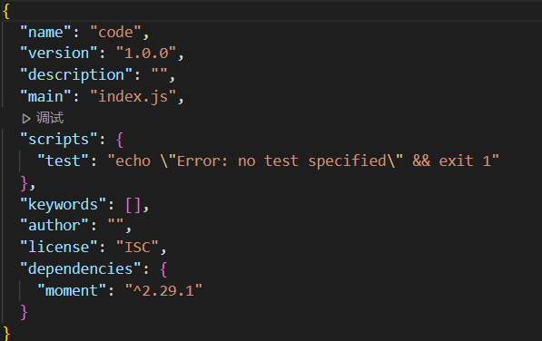
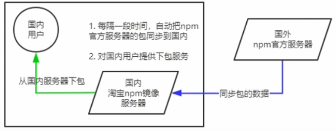
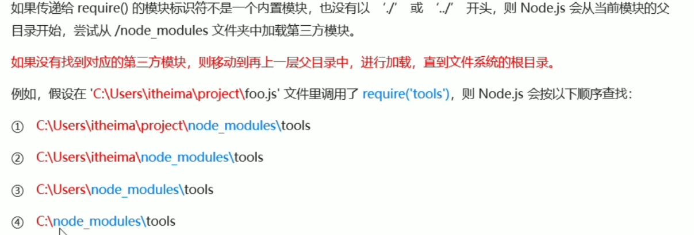
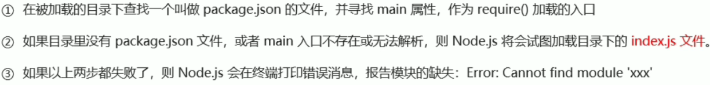

<!-- ---
title: Nodejs学习记录01
date: 2022-1-20 16:20:33
tags:
 - Nodejs
 - JavaScript
 - 前端
categories:
 - 前端学习
 - Nodejs
--- -->
## Node.js学习记录

### 浏览器中的JavaScript的组成部分

1. JS核心语法
- 变量、数据类型
- 循环、分支、判断
- 函数、作用域、this
- etc(面向对象等)
2. WebAPI
- DOM操作
- BOM操作
- 基于XMLHttpRequest的Ajax操作
- etc
  
#### 为什么JavaScript可以在浏览器中被执行


不同的浏览器使用不同的JavaScript解析引擎：
- Chrome浏览器 => V8
- Firefox浏览器 => OdinMonkey  --奥丁猴
- Safri浏览器 => JSCore
- IE浏览器 => Chakra  --查克拉
- etc

其中，Chrome 浏览器的V8解析引擎最好！

#### 为什么JavaScript可以操纵DOM和BOM



#### 浏览器中的JavaScript运行环境


总结：
1. V8引擎负责解析和执行JavaScript代码
2. 内置API是由<span style="color: red">运行环境</span>提供的特殊接口，<span style="color: rgb(234, 28, 32)">只能在所属的运行环境中被调用</span>

### 什么是Node.js

    Node.js是一个基于Chorome V8引擎的JavaScript运行环境

#### Node.js的js运行环境



注意：
1. 浏览器是JavaScript的前端运行环境。
2. Node.js是JavaScript的后端运行环境。
3. Node.js中级工无法调用DOM和BOM等浏览器内置API

#### Node.js可以做什么

1. 基于EXpress框架(http://www.expressjs.com.cn/), 可以快速构建Web应用
2. 基于Electron框架(https://electronjs.org/), 可以构建跨平台的桌面应用
3. 基于restify框架(http://restify.com/), 可以快速构建API接口项目
4. 读写和操作数据库、创建使用的命令行工具辅助前端开发、etc...

### fs文件系统模块

#### 什么是fs文件系统模块

<span style="color: red">fs模块</span>是Node.js官方提供的、用来操作文件的模块。它提供了一系列的方法和属性，用来满足用户对文件的操作需求。

eg：
1. fs.readFile()方法，用来读取指定文件中的内容
2. fs.writeFile()方法，用来向指定的文件中写入内容

如果要在JavaScript代码中，使用fs模块来操作文件，则需要使用如下的方式先导入它：

``` js
const fs = require('fs')
```

#### 读取指定文件中的内容

1. fs.readFile()的语法格式
使用fs.readFile()方法，可以读取指定文件中的内容，语法格式如下：
```js
fs.readFile(path[, options], callback)
```
参数解读：
- 必选参数(path), 字符串, 表示文件的路径。
- 可选参数(options), 表示以什么编码格式来读取文件。
- 必选参数(callback), 文件读取完成后, 通过回调函数拿到读取的结果。

2. fs.readFile()的示例代码
```js
const fs = require('fs')

fs.readFile(path, 'utf8', function(err, dataStr){
    if(err) return console.log('读取文件失败', err.message)

    console.log('读取成功', dataStr)
})
```

#### 向指定的文件中写入内容

##### fs.writeFile()的格式

使用fs.writeFile()方法，可以向指定的文件中写入内容，语法格式如下：

```js
fs.writeFile(file, data[, options], callback)
```

参数解读：
- 必选参数(file), 需要指定一个文件路径的字符串，表示文件的存放路径。
- 必选参数(data), 表示要写入的内容,
- 可选参数(options), 表示以什么编码格式来读取文件。
- 必选参数(callback), 文件写入完成后的回调函数

注意点：
1. fs.writeFile()方法只能用来创建文件，不能用来创建路径
2. 重复调用fs.writeFile() 写入同一个文件，新写入的内容会覆盖之前的旧内容

#### fs路径动态拼接的问题

在使用fs模块操作文件时，如果提供的操作路径是以./或../开头的<span style="color: red">相对路径</span>时，很容易出现路径动态拼接错误的问题。

1. 原因：代码在运行时，<span style="color: red">会以执行node命令时所处的目录<span/>，动态拼接出被操作文件的完整路径。

2. 解决方案：

<b>方案1：提供一个完整的文件存放路径(绝对路径)</b>

缺点：移植性非常差、不利于维护

<b>方案2：__dirname + '相对文件路径'</b>

### path路径模块

#### 概念

path模块时Node.js官方提供的、用来处理路径的模块。它提供了一系列的方法和属性吗，用来满足用户对路径的处理需求。

eg:

1. path.join()方法，用来将多个路径片段拼接成一个完整的路径字符串
2. path.basename()方法，用来从路径字符串中，将文件名解析出来

同理要先导入
```js
const path = require('path')
```

#### 路径拼接

1. path,join的语法格式

使用path.join()方法，可以把多个路径拼接成完整的路径字符串，语法格式如下：
```js
path.join([...paths])
```

参数解读：

· ...paths: 字符串 路径片段的序列
· 返回值：字符串

eg:
```js
const pathStr = path.join('/a', '/b/c', '../'. './d', 'e')
console.log(pathStr)  // 输出  \a\b\d\e

const pathStr2 = path.join(__dirname, './files/1.txt)
console.log(pathStr2)
```

注意：<span style="color: red">今后凡是涉及到路径拼接的操作，都要使用path.join()方法处理</span>。不要直接使用+进行字符串的拼接 
原因：eg： fs.readFile(path.join(__dirname + './files/1.txt')) 可以屏蔽掉. 然后+不行。

#### 获取路径中的文件名

1. path.basename()的语法格式

使用path.basename()方法，可以从一个文件路径中，获取到文件的名称部分：

```js
const fpath = '/a'
```

#### 获取路径中的文件扩展名

1. path.extname()的语法格式

使用path.extname()方法，可以获取路径中的扩展名部分：

```js
const fpath = '/a/b/c/index.html/' 

const fext = path.extname(fpath)

console.log(fext)  //  输出 .html
```

### http模块

#### 什么是客户端、什么是服务器

在网络节点中，负责消费资源的电脑，叫做客户端；负责对外提供网络资源的电脑，叫做服务器。

<span style="color: red">http模块</span>是Node.js官方提供的、用来<span style="color: red">创建Web服务器</span>的模块。通过http模块提供的<span style="color: skyblue">http.createServer()方法</span>，就能方便的把一台普通的电脑，变成一台Web服务器，从而对外提供Web资源服务。

如果要希望使用http模块创建Web服务器，则需要先导入它：

```js
const http = require('http')
```

#### 进一步理解http模块的作用

服务器和普通电脑的<span style="color: red">区别</span>在于，服务器上安装了Web服务器软件，例如：IIS、Apache等。通过安装这些服务器软件，就能把一台普通的电脑变成一台Web服务器。

在Node.js中，我们<span style="color: skyblue">不需要使用</span>IIS、Apache等这些第三方Web服务器软件。因为我们可以基于Node.js提供的http模块，<span style="color: red">通过几行简单的代码，就能轻松的手写一个服务器软件</span>，从而对外提供Web服务。

#### 服务器相关的概念

1. IP地址

<span style="color: red">IP地址</span>就是互联网上<span style="color: red">每一台计算机的唯一地址</span>，因此IP地址具有唯一性。如果把"个人电脑"比作"一台电话"，那么"IP地址"就相当于"电话号码"，只有在知道对方的IP地址的前提下，才能与对应的电脑之间进行数据通信。

IP地址的格式：通常用"点分十进制"表示成(a,b,c,d)的形式，其中，a-d都是0-255之间的十进制整数。例如：用点分十进表示的IP地址(192.168.1.1)

注意：

1. 互联网中每台Web服务器，都有自己的IP地址，例如：可以在Win终端中运行 ping www.baidu.com命令，即可查到百度服务器的IP地址。
2. 在开发期间，自己的电脑既是一台服务器，也是一个客户端，为了方便测试，可以在自己的浏览器中输入127.0.0.1这个IP地址，就能把自己的电脑当作服务器来访问了。

2. 域名和域名服务器

域名就是字符型的地址方案，即所谓的域名地址(Domain Name)

IP地址和域名是一一对应的关系，这份对应关系存放在一种叫做服务器(DNS, Domain name server)的电脑中。使用者只需通过好记的域名访问对应的服务器即可，对应的转换工作由域名服务器实现。因此，域名服务器就是提供IP地址和域名之间的转换服务的服务器。

注意：
1. 单纯使用IP地址，互联网中的电脑也能正常工作。有域名，能让它更方便。
2. 在开发测试期间，127.0.0.1对应的域名是localhost，他们都代表我们自己的电脑，在使用效果上没有任何区别。

3. 端口号

一台电脑中，可以运行成百上千个Web服务。每个Web服务器都对应一个唯一的端口号。客户端发送过来的网络请求，通过端口号，可以被准确地交给对应的Web服务进行处理。

注意：
1. 每个端口号不能同时被多个Web服务占用。
2. 在实际应用中，URL中的80端口可以被省略

#### 创建基本的web服务器
Step:
1. 导入http模块
```js
const http = require('http')
```
2. 调用http.createServer()方法

```js
const server = http.createServer()
```

3. 为服务器实例绑定request事件，即可监听客户端发送过来的网络请求：
```js
server.on('request', (req,res) => {
   // 只要有客户端来请求我们自己的服务器，就会触发request事件，从而调用这个事件处理函数
   console.log('Someone visit our web server')
})
```

4. 启动服务器

调用服务器实例的.listen()方法，即可启动当前的Web服务器实例：
```js
// 调用 server.listen(端口号，cb回调)方法，即可启动Web服务器
server.listen(80, ()=>{
   console.log('http server running at http://127.0.0.1')
})
```

5. req请求对象

只要服务器接收到了客户端的请求，就会调用通过server.on()为服务器绑定的request事件处理函数。如果想在事件处理函数中，访问与客户端相关的数据或属性，可以使用如下的方式：
```js
server.on('request',(req)=>{
    //req 是请求对象
    const str = 'Your request url is ${req.url} , and request method is ${req.method}'
    console.log(str)
})
```

6. res响应对象

在服务器的request事件处理函数中，如果想访问与服务器相关的数据或者属性，可以使用如下方式：
```js
server.on('request', (req,res)=>{
    // res是响应对象，它包含了与服务器相关的数据和属性，例如：
    // 要发送到客户端的字符串
    const str = `Your request url is ${req.url},and request method is ${req.method}`
    // req.end()方法的作用：
    // 向客户端发送指定的内容，并结束这次请求的处理过程
    res.end(str)
})
```

7. 解决中文乱码的问题

当调用res.end()方法，向客户端发送中文内容的时候，会出现乱码问题，此时，需要手动设置内容的编码格式：
```js
server.on('request',(req, res)=>{
    const str = `您请求的url地址是 ${req.url}, 请求的method是${req.method}`

    // 调用res.setHeader()方法，设置Content-Type响应头，解决中文乱码的问题
    res.setHeader('Content-Type', 'text/html; charset=utf-8')

    res.end(str)
})
```

#### 根据不同的url响应不同的html内容

1. 核心实现步骤：

 获取请求的url地址
 设置默认的响应内容为404 Not found
 判断用户请求的是否为 / 或 /index.html首页
 判断用户请求的是否为 /about.html 关于页面
 设置Content-Type响应头，防止中午乱码
 使用res.end()把内容响应给客户端

2. 动态响应内容：

```js
server.on('request', function(req, res) {
    const url = req.url

    let content = '<h1> 404 Not found</h1>'
    
    if(url === '/' || url === '/index.html') {
        content = '<h1>首页</h1>'

    }else if(url === '/about.html'){
        content = '<h1>关于页面</h1>'
    }
    res.setHeader('Content-Type', 'text/html; charset=utf-8')
    res.end(content)
})
```

### 模块化的基本概念

#### 什么是模块化

    模块化是指解决一个复杂问题时，自顶向下逐层把系统划分成若干模块的过程。对于整个系统来说，模块是可组合、分解和更换的单元。

编程领域中的模块化，就是遵守固定的规则，摆一个大文件拆成独立并互相依赖的多个小模块。

把代码进行模块化拆分的好处：

1. 提高了代码的复用性
2. 提高了代码的可维护性
3. 可以实现按需加载

#### 模块化规范

模块化规范就是对代码进行模块化的拆分与组合时，需要遵守的那些规则。

例如：

* 使用什么样的语法格式来引用模块
* 在模块中使用什么样的语法格式向外暴露成员

模块化规范的好处：大家都遵守同样的模块化规范写代码，降低了沟通的成本，极大方便了各个模块之间的相互调用，利人利己。

### Node.js中的模块化

#### Node.js中模块的分类

Node.js中根据模块来源的不同，将模块分为了3大类，分别是：
* 内置模块(内置模块是由Node.js官方提供的，例如fs、path、http等)
* 自定义模块(用户创建的每个.js文件，都是自定义模块)
* 第三方模块(由第三方开发出来的模块，并非官方提供的内置模块，也不是用户创建的自定义模块，使用前需要先下载 )

#### 加载模块

使用强大的require()方法，可以加在需要的内置模块、用户自定义模块、第三方模块进行使用。例如：

```js
// 加载内置fs模块
const fs = require('fs')

// 加载用户自定义模块
const custom = require('./custom.js')

// 加载第三方模块(关于第三方模块的下载和使用，会在后面的课程中进行专门的讲解)
const moment = require('moment')
```

注意：使用require()方法加载其他模块时，会执行被加载模块中的代码

#### Node.js中的模块作用域

1. 什么是模块作用域

和函数作用域类似，在自定义模块中定义的变量、方法等成员，只能在当前模块内被访问，这种模块级别的访问限制，叫做模块作用域。

2. 模块作用域的好处

防止了全局变量污染的问题


#### 向外共享模块作用域中的成员

1. module对象

在每个.js自定义模块中都有一个module对象，它里面存储了和当前模块有关的信息，打印如下：


2. module.exports对象

在自定义模块中，可以使用module.exports对象，将模块内的成员共享出去，供外界使用。
外界用require()方法导入自定义模块时，得到的即使module.exports所指的对象

3. 共享成员时的注意点

使用require()方法导入模块时，导入的结果，永远以module.exports指向的对象为准。

4. exports对象

默认情况下，exports和module.exports指向同一个对象。最终共享的结果，还是以module.exports结果为准。

#### Node.js中的模块化规范

    Node.js遵循了CommonJS模块化规范，CommonJS规定了模块的特性和各模块之间如何相互依赖。

CommonJS规定：

1. 每个模块内部，module变量代表当前模块。
2. module变量是一个对象，它的exports属性(即module.exports)是对外接口。
3. 加载某个模块，其实是加载该模块的module.exports属性。require()方法用于加载模块

### npm与包

#### 什么是包

NOde.js中的第三方模块又叫做包

第三方模块和包是一个概念，只是叫法不同。

#### 为什么需要包

由于Node.js的内置模块仅提供一些底层的API，导致在基于内置模块进行项目开发时，效率很低。

包是基于内置模块封装出来的，提供了更高级、更方便的API，极大的提高了开发效率。

包和内置模块之间的关系，类似于jQuery和浏览器内置API之间的关系。

#### npm初体验

1. 格式化时间的传统做法

step:
* 创建格式化时间的自定义模块
* 定义格式化时间的方法
* 创建补零函数
* 从自定义模块中导出格式化时间的函数
* 导入时间格式化的自定义模块
* 调用格式化时间的函数

```js
function dataFormat(dtStr){
    const dt = new Date()

    const y = dt.getFullYear()
    const m = padZero(dt.getMonth() + 1) 
    const d = padZero(dt.getDate()) 

    const hh = padZero(dt.getHours()) 
    const mm = padZero(dt.getMinutes()) 
    const ss = padZero(dt.getSeconds()) 

    return `${y}-${m}-${d} ${hh}:${mm}:${ss} `
};

// 补零函数
function padZero(n){
    return n > 9 ? n : '0' + n
}

module.exports = {
    dataFormat
}
```

2. 格式化时间的高级做法

* 使用npm包管理工具，在项目中安装格式化时间的包moment
* 使用require()导入格式化时间的包
* 参考moment官方API文档对时间进行格式化
```js
const moment = require('moment')

const dt = moment().format('YYYY-MM-DD HH:mm:ss')

console.log(dt)
```

3. 包的语义化版本规范

包的版本号是以"点分十进制"形式进行定义的，总共有三位数字，例如2.24.0

其中每一位数字所代表的含义如下：
第1位数字：大版本
第2位数字：功能版本
第3位数字：Bug修复版本

版本号提升的规则：只要前面的版本号增长了，则后面的版本号归零。

#### 包管理配置文件

    npm规定，在项目根目录中，必须提供一个叫做package.json的包管理配置文件。用来记录与项目有关的一些配置信息。例如：
    * 项目的名称、版本号、描述等
    * 项目中都用到了哪些包
    * 哪些包只会在开发期间会用到
    * 那些包在开发和部署时都需要用到

1. 快速创建package.json

npm包管理工具提供了一个快捷命令，可以在执行命令时所处的目录中，快速创建package.json这个包管理配置文件：
```js
npm init -y 
```
注意：
* 上述命令只能在英文的目录下成功运行！所以，项目文件夹的名称一定要使用英文命名，不要使用中文，不能出现空格。
* 运行npm install 命令安装包的时候，npm 包管理工具会自动的把包名称和版本号  ，记录到package.json中。

2. dependencies节点

package.json文件中，有一个dependencies节点，专门用来记录您使用npm install 命令安装了哪些包



3. 卸载包

可以运行npm uninstall命令，来卸载指定的包

```js
npm uninstall moment
```

注意：npm uninstall 命令执行成功后，会把卸载的包，自动地从package.json的dependencies中移除掉。

4. devDependencies节点

    如果某些包只在项目开发阶段会用到，在项目上线之后不会用到，则建议把这些包记录到devDependencies节点中。
    与之对应的，如果某些包在开发阶段和项目上线之后都需要用到，则建议把这些包记录到dependencies节点中。

您可以使用如下的命令，将包记录到devDependencies节点中：
```js
npm i 包名 -D

npm install 包名 --save--dev
```

#### 解决下包速度慢的问题

1. 淘宝npm镜像服务器

慢的原因如图：


淘宝在国内搭建了一个服务器，专门把国外服务器上的包同步到国内的服务器，然后在国内提供下包的服务。从而极大的提供了下包的速度。


扩展：
镜像(Mirroring)是一种文件存储形式，一个磁盘上的数据在另一个磁盘上存在一个完全相同的副本即为镜像。

2. 切换npm的下包镜像源

下包的镜像源，指的就是下包的服务器地址。

```js
// 查看当前的下包镜像源
npm config get registry
// 将下包的镜像源切换为淘宝镜像源
npm config set registry = https://registry.npm.taobao.org/
// 检查镜像源是否下载成功
npm config get registry
```

3. nrm

为了更方便的切换下包的镜像源，我们可以安装nrm这个小工具，利用nrm提供的终端命令，可以快速查看和切换下包的镜像源

```js
// 通过npm包管理器，将nrm安装为全局可用的工具
npm i nrm -g
// 查看所有可用的镜像源
nrm ls
// 将下包的镜像源切换为taobao镜像
nrm use taobao
```

#### 包的分类

1. 项目包

那些被安装到项目的node_modules 目录中的包，都是项目包。

项目包又分为两类，分别是：

* 开发依赖包(被记录到devDependencies节点中的包，只会在开发期间会用到)
* 核心依赖包(被记录到dependencies节点中的，在开发期间和项目上线之后都会用到)

```js
npm i 包名 -D
npm i 包名
```

2. 全局包

在执行npm install命令时，如果提供了-g参数，则会把包安装为全局包。
全局包会被安装到C:\Users\用户目录\AppData\Roaming\npm\node_modules目录下。
```js
npm i 包名-g
npm uninstall 包名 -g 
```
注意：
* 只有工具性质的包，才有全局安装的必要性。因为它们提供了好用的终端命令。
* 判断某个包是否需要全局安装后才能使用，可以参考官方提供的使用说明即可。

3. i5ting_toc

i5ting_toc是一个可以把md文档转为html 页面的小工具，使用步骤如下：
```js
npm i -g i5ting_toc

// 调用i5ting_toc ，轻松实现md转为html的功能
i5ting_toc -f 要转换的md文件路径 -o
```

#### 规范的包结构

    包的内部结构
一个规范的包，它的组成结构，必须符合以下3点要求：
1. 包必须以单独的目录而存在
2. 包的顶级目录下要必须包含package.json这个包管理配置文件
3. package.json中必须包含name、version、main这三个属性，分别代表包的名字、版本号、包的入口

    注意：以上3点要求是一个规范的包结构必须遵守的格式，关于更多的约束，可以参考如下网址：
    https://yarnpkg.com/zh-Hans/docs/package-json

#### 开发属于自己的包

1. 初始化包的基本结构

* 新建lCoder-tools文件夹，作为包的根目录
* 在lCoder-tools文件夹中，新建如下三个文件：
    · package.json (包管理配置文件)
    · index.js (包的入口文件)
    · README.md (包的说明文档)

2. 初始化package.json
```json
{
    "name": "lCoder-tools",
    "version": "1.0.0",
    "main": "index.js",
    "description": "提供了格式化时间、HTMLEscape相关的功能",
    "keywords": [
        "lCoder",
        "dateFormat",
        "escape"],
    "license": "ISC"
}
```

3. 在index.js中定义格式化时间的方法

4. 在index.js中定义转义html的方法

5. 在index.js中定义还原html的方法
   
6. 将不同的功能进行模块化拆分

* 将格式化时间的功能，拆分到src -> dateFormat.js 中
* 将处理HTML字符串的功能，拆分到src -> htmlEscape.js中
* 在index.js中，导入两个模块，得到需要向外共享的方法
* 在index.js中，使用module.exports把对应的方法共享出去                                     

7. 编写包的说明文档

包根目录中的README.md文件，是包的使用说明文档。

一般内容：
安装方式、导入方式、功能介绍、开源协议

#### 发布包

1. 注册npm账号

2. 登录npm账号
在本地登录npm login

注意：在运行npm login命令之前，必须先把下包的服务器地址切换为npm的官方服务。否则会导致发布包的失败

3. 把包发布到Npm上

在终端切换的包的根目录之后，运行npm publish 命令，即可将包发布到npm上(注意：包名不能雷同)

4. 删除已发布的包

运行npm unpublish 包名 --force 命令，即可从npm删除已发布的包

注意：
* npm unpublish 命令只能删除72小时之内发布的包
* npm unpublish 删除的包，在24小时之内不允许重复发布


### 模块的加载机制

1. 优先从缓存中加载

模块在第一次加载后会被缓存。这也意味着多次调用require()不会导致模块的代码被执行多次。

注意：不论是内置模块、用户自定义模块、还是第三方模块，它们都会优先从缓存加载，从而提高模块的加载效率

2. 内置模块的加载机制
   
内置模块是由Node.js官方提供的模块，内置模块的加载优先级最高。

例如：```js require('fs')```始终返回内置的fs模块，即使在node_modules目录下有名字相同的包也叫fs

3. 自定义模块的加载机制

    使用require()加载自定义模块时，必须指定以./或../开头的路径标识符。在没有指定./或../这样的路径标识符时，则node会把它当作内置模块或第三方模块进行加载。

同时，在使用require()导入自定义模块时，如果省略了文件的扩展名，则Node.js会按顺序分别尝试加载以下的文件：
* 按照确切的文件名进行加载
* 补全.js扩展名进行加载
* 补全.json扩展名进行加载
* 补全.node扩展名进行加载
* 加载失败，终端报错

4. 第三方模块的加载机制



5. 以目录作为模块

目录作为模块标识符，传递给require()进行加载的时候，有三种加载方式：

